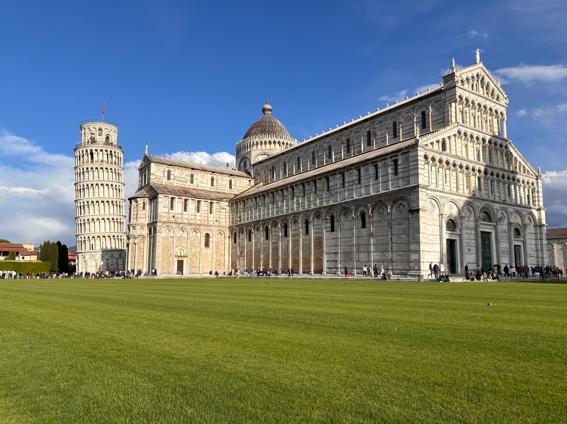

# Depth-pro-pointcloud
This repo includes a post-processing step following Apple's [Depth Pro: Sharp Monocular Metric Depth in Less Than a Second](https://arxiv.org/abs/2410.02073) to produce a point cloud from the output depth map.

<p align="center">
  
</p>

<div style="display: flex; justify-content: space-between;">
  
  
</div>

🚀 First Iteration Alert! 🚀
Help is needed to ensure that the code outputs a point cloud in the metric system. Your expertise is welcomed!

# 🛠️ Setup 
Clone the original [Depth-pro repo](https://github.com/apple/ml-depth-pro) repo and follow the instructions to setup the environment

 ```
git clone https://github.com/apple/ml-depth-pro
```

Clone this repo

 ```
git clone https://github.com/stefp/Depth-pro-pointcloud
cd Depth-pro-pointcloud
```

Create a new conda environment
 ```
conda create -n depthPro_pc python=3.9
conda activate depthPro_pc
```

Install dependencies in conda shell (ensure to install the right PyTorch CUDA version check [see PyTorch version tool](https://pytorch.org/get-started/locally/))
```
pip3 install torch torchvision torchaudio --index-url https://download.pytorch.org/whl/cu121
pip install numpy pillow torch opencv-python
python3 -m pip install laspy[lazrs,laszip]
```

Check in a python environment that you've installed a pytorch version that has access to GPU
```
import torch
torch.cuda.is_available()
```

There might be some other package to install (TO CHECK!)

# ▶️ Run 
In shell run the following
```
python depth-pro-pointcloud.py path_to_your_image/your_image.jpg
```

💡 Tip: You can change the image (*.jpeg, *.jpg, *.png, *.jfif, etc.) to any image you have on hand!

# 🙏 Help Needed!
It seems the output scale might be off. Anyone willing to help fix this? 🤔
## To do list
- ensure the output point cloud is correctly scaled (metric)
- point cloud filtering (e.g statistical outlier removal SOR) for removing sparse points around edges
- ...

